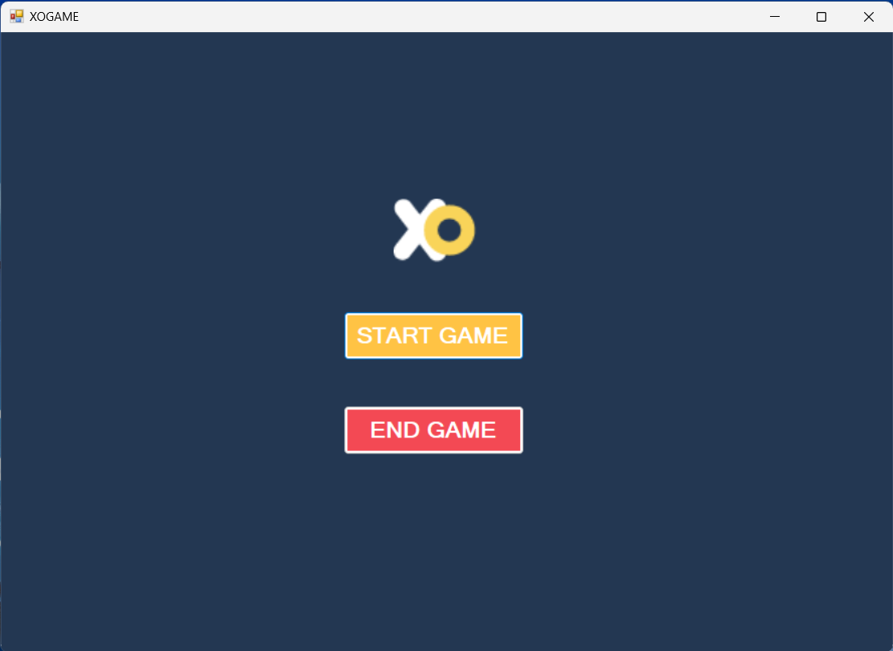
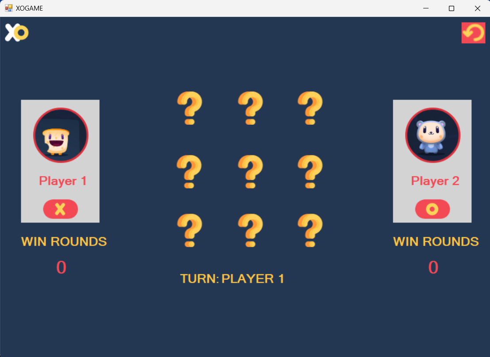
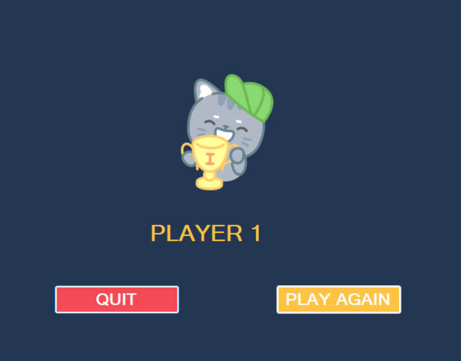
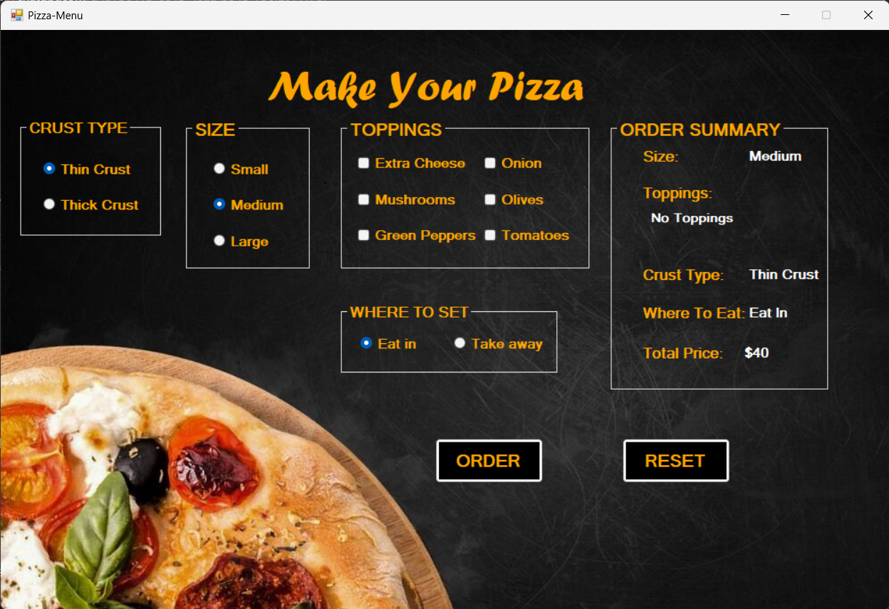

# Mini-Projects
Welcome to the MiniProjects repository! This repository features a collection of small C# projects developed using Windows Forms. The primary focus is on demonstrating core programming logic and important concepts such as Object-Oriented Programming (OOP) in C#. Each project showcases practical examples to enhance your understanding and skills.

## Projects Included

### Project 1: Tic-Tac-Toe Game

A simple implementation of the classic Tic-Tac-Toe game for two players.
#### Features:
- **Two-Player Mode:** Allows two players to play against each other.
- **Round Winner Tracking:** Keeps track of the number of rounds won by each player.
- **Player Turn Indicator:** Displays which player should play next.
- **Game Winner Announcement:** Shows the winner of the game after each round.
- **Retry Option:** Allows players to retry the game without restarting the application.

#### Key Concepts:
- **Object-Oriented Programming:** Encapsulation, inheritance, and polymorphism.
- **Event Handling:** Responding to user actions such as clicks.
- **Game Logic:** Implementing the rules and win conditions for Tic-Tac-Toe.
- **UI Design:** Creating a user-friendly interface using Windows Forms.
#### Screens:
<div style="display: flex;">
    <div style="flex: 50%; padding: 5px;">
        
    </div>
    <div style="flex: 50%; padding: 5px;">
        
    </div>
    <div style="flex: 50%; padding: 5px;">
        
    </div>
</div>

### Project 2: Pizza Order System

A basic application for ordering pizzas with customizable options.

#### Features:
- **Size Selection:** Choose the size of the pizza (small, medium, large).
- **Crust Type Selection:** Choose the type of crust (thin, thick).
- **Toppings Selection:** Select various toppings to add to the pizza.
- **Order Location:** Specify where the order should be delivered or picked up.
- **Order Summary:** Provides a summary of the order including all selected options.
- **Price Calculation:** Calculates the total price of the order based on selections.

#### Key Concepts:
- **Object-Oriented Programming:** Creating and managing objects to represent pizzas, orders, etc.
- **Data Binding:** Binding data to UI elements for real-time updates.
- **Price Calculation Logic:** Implementing business logic to calculate the price based on user selections.
### Screens:


## Getting Started

To get started with any of the projects:

1. Clone the repository:
    ```bash
    git clone https://github.com/Naeem-Arafa/Mini-Projects.git
    cd Mini-Projects
    ```

2. Navigate to the project directory you want to explore.

3. Open the project in Visual Studio or your preferred C# IDE.

4. Build and run the project:
    - For Tic-Tac-Toe: Navigate to the `TicTacToe` directory and open the solution file.
    - For Pizza Order System: Navigate to the `PizzaOrder` directory and open the solution file.
